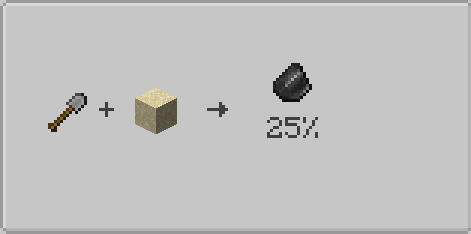
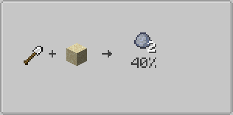
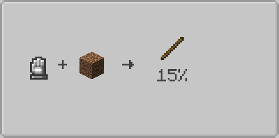
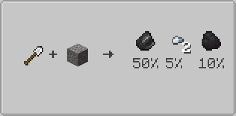

# Examples

This page contains ready-to-use Scavenging recipe examples.

## Sand with a Shovel

This recipe requires a stone shovel and has a 25% chance to drop flint.



=== "JSON"

    ```json
    {
      "type": "scavenging:scavenging",
      "tool": {
        "item": "minecraft:stone_shovel"
      },
      "block": "minecraft:sand",
      "outputs": [
        {
          "item": {
            "id": "minecraft:flint",
            "count": 1
          },
          "chance": 0.25
        }
      ]
    }
    ```

=== "KubeJS"

    ```js
    ServerEvents.recipes(event => {
      event.recipes.scavenging.scavenging(
        'minecraft:sand',
        [
          {
            item: 'minecraft:flint',
            chance: 0.25
          }
        ]
      ).tool('minecraft:stone_shovel')
    })
    ```

=== "KubeJS JSON"

    ```js
    ServerEvents.recipes(event => {
      event.custom({
        type: 'scavenging:scavenging',
        tool: {
          item: 'minecraft:stone_shovel'
        },
        block: 'minecraft:sand',
        outputs: [
          {
            item: {
              id: 'minecraft:flint',
              count: 1
            },
            chance: 0.25
          }
        ]
      })
    })
    ```

## Damaging Tool Recipe

This recipe consumes 1 durability from the tool every time it is executed.



=== "JSON"

    ```json
    {
      "type": "scavenging:scavenging",
      "tool": {
        "item": "minecraft:iron_shovel"
      },
      "damage_tool": true,
      "block": "minecraft:sand",
      "outputs": [
        {
          "item": {
            "id": "minecraft:clay_ball",
            "count": 2
          },
          "chance": 0.4
        }
      ]
    }
    ```

=== "KubeJS"

    ```js
    ServerEvents.recipes(event => {
      event.recipes.scavenging.scavenging(
        'minecraft:sand',
        [
          {
            item: Item.of('minecraft:clay_ball', 2),
            chance: 0.4
          }
        ]
      ).tool('minecraft:iron_shovel').damageTool(true)
    })
    ```

=== "KubeJS JSON"

    ```js
    ServerEvents.recipes(event => {
      event.custom({
        type: 'scavenging:scavenging',
        tool: {
          item: 'minecraft:iron_shovel'
        },
        damage_tool: true,
        block: 'minecraft:sand',
        outputs: [
          {
            item: {
              id: 'minecraft:clay_ball',
              count: 2
            },
            chance: 0.4
          }
        ]
      })
    })
    ```

## Bare Hand Scavenging

This recipe only works when the player right-clicks the block with an empty hand.



=== "JSON"

    ```json
    {
      "type": "scavenging:scavenging",
      "requires_empty_hand": true,
      "block": "minecraft:dirt",
      "outputs": [
        {
          "item": {
            "id": "minecraft:stick",
            "count": 1
          },
          "chance": 0.15
        }
      ]
    }
    ```

=== "KubeJS"

    ```js
    ServerEvents.recipes(event => {
      event.recipes.scavenging.scavenging(
        'minecraft:dirt',
        [
          {
            item: 'minecraft:stick',
            chance: 0.15
          }
        ]
      ).requiresEmptyHand(true)
    })
    ```

=== "KubeJS JSON"

    ```js
    ServerEvents.recipes(event => {
      event.custom({
        type: 'scavenging:scavenging',
        requires_empty_hand: true,
        block: 'minecraft:dirt',
        outputs: [
          {
            item: {
              id: 'minecraft:stick',
              count: 1
            },
            chance: 0.15
          }
        ]
      })
    })
    ```

## Multiple Outputs

Each output is rolled independently, so several items can drop from the same scavenging action.



=== "JSON"

    ```json
    {
      "type": "scavenging:scavenging",
      "tool": {
        "item": "minecraft:iron_shovel"
      },
      "damage_tool": true,
      "block": "minecraft:gravel",
      "outputs": [
        {
          "item": {
            "id": "minecraft:flint",
            "count": 1
          },
          "chance": 0.5
        },
        {
          "item": {
            "id": "minecraft:iron_nugget",
            "count": 2
          },
          "chance": 0.05
        },
        {
          "item": {
            "id": "minecraft:coal",
            "count": 1
          },
          "chance": 0.1
        }
      ]
    }
    ```

=== "KubeJS"

    ```js
    ServerEvents.recipes(event => {
      event.recipes.scavenging.scavenging(
        'minecraft:gravel',
        [
          {
            item: 'minecraft:flint',
            chance: 0.5
          },
          {
            item: Item.of('minecraft:iron_nugget', 2),
            chance: 0.05
          },
          {
            item: 'minecraft:coal',
            chance: 0.1
          }
        ]
      ).tool('minecraft:iron_shovel').damageTool(true)
    })
    ```

=== "KubeJS JSON"

    ```js
    ServerEvents.recipes(event => {
      event.custom({
        type: 'scavenging:scavenging',
        tool: {
          item: 'minecraft:iron_shovel'
        },
        damage_tool: true,
        block: 'minecraft:gravel',
        outputs: [
          {
            item: {
              id: 'minecraft:flint',
              count: 1
            },
            chance: 0.5
          },
          {
            item: {
              id: 'minecraft:iron_nugget',
              count: 2
            },
            chance: 0.05
          },
          {
            item: {
              id: 'minecraft:coal',
              count: 1
            },
            chance: 0.1
          }
        ]
      })
    })
    ```