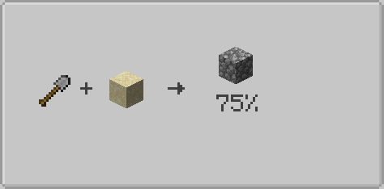

# FAQ

??? question "Can I use multiple outputs?"

    Yes.

    Each output is rolled independently and may drop at the same time as other outputs.

??? question "Can I create recipes that use no tool?"

    Yes.

    Use:

    === "Json"

        ```json
        {
            "requires_empty_hand": true
        }
        ```

    === "KubeJS"

        ```js
        .requiresEmptyHand(true)
        ```

??? question "Can tools lose durability?"

    Yes.

    Use:

    === "Json"

        ```json
        {
            "damage_tool": true
        }
        ```

    === "KubeJS"

        ```js
        .tool('minecraft:iron_shovel').damageTool(true)
        ```

    The tool will lose 1 durability every time the recipe is executed.

??? question "Are datapacks supported?"

    Yes.

    Recipes are loaded through the standard Minecraft datapack system.

??? question "Is KubeJS supported?"

    Yes.

    Scavenging recipes can be added through `event.recipes.scavenging.scavenging()` or through `event.custom()`.

??? question "Is JEI supported?"

    Yes.

    All Scavenging recipes are automatically displayed in JEI.

    